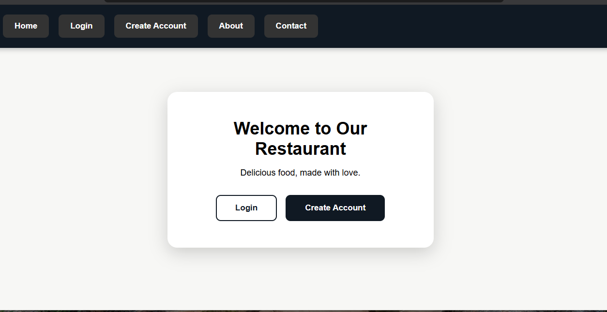

# 🍽️ Restaurant Website

A full front-end restaurant ordering website built with vanilla HTML, CSS, and JavaScript — featuring account authentication, a shopping cart, order tracking, and a simulated admin dashboard, all powered by browser `localStorage`.

**Live Demo:** [https://mutaz44.github.io/restaurant-website/](https://mutaz44.github.io/restaurant-website/)





---

## ✨ Features

**Customer Experience**
- Account creation and login (with input validation)
- Protected pages — unauthenticated users are redirected to login
- Browsable menu with category filtering and live search
- Dedicated food details page for each item
- Shopping cart with add/remove and quantity control
- Full order history with live order status (Preparing → Out for Delivery → Delivered)
- Editable user account/profile page
- Custom confirmation modals (no default browser `alert()`/`confirm()`)
- Loading state on checkout for a smoother experience
- Fully responsive design (mobile, tablet, desktop)
- Custom 404 page

**Admin Experience (Demo)**
- Password-protected admin dashboard (`admin.html`)
- View all orders and advance their status manually
- Clearly labeled as a **local simulation** — see [Notes](#-notes--limitations) below

**Design**
- Custom UI components (buttons, cards, badges, modals) built from scratch in CSS
- Font Awesome icons and a dynamically generated favicon
- Smooth scroll behavior

---

## 🛠️ Tech Stack

- **HTML5** — semantic structure across 12 pages
- **CSS3** — custom styling, Flexbox/Grid layouts, media queries for responsiveness
- **JavaScript (Vanilla)** — no frameworks; DOM manipulation, event handling, and `localStorage` for data persistence
- **Font Awesome** (via CDN) — icon set

---

## 📁 Project Structure
restaurant-website/
├── index.html          # Homepage (hero, featured dishes, gallery, testimonials)
├── login.html           # User login
├── signup.html           # Account creation
├── menu.html             # Menu with category filters + cart
├── food-details.html     # Individual food item details
├── account.html           # User profile
├── orders.html             # Order history + status
├── confirmation.html        # Order confirmation
├── about.html                # About the restaurant
├── contact.html               # Contact information
├── admin.html                   # Admin dashboard (demo)
├── 404.html                      # Custom not-found page
├── style.css                      # All styling
├── script.js                       # All application logic
└── images/                          # Food & 
restaurant photos
---

## 🚀 Getting Started

No build tools or dependencies required.

1. Clone or download this repository
2. Open `index.html` in your browser

   _or, for the best experience, serve it locally:_

   ```bash
  npx serve.
3.creat an account,browse the menu,and place an order!
Admin demo: open (admin.html) directly and log in with password (admin123) .
📝 Notes & Limitations
This is a front-end learning project built to practice DOM manipulation, state management, and UI/UX design without a backend framework. A few intentional simplifications:
Data storage: All data (accounts, carts, orders) is stored in the browser's localStorage, scoped to a single device/browser. In a production app, this would be replaced with a real backend (e.g., Node.js/Express) and a database (e.g., PostgreSQL/MongoDB) so data is shared and persistent across devices and users.
Passwords: Stored as plain text in localStorage for demo purposes only — a real application would hash passwords server-side and never expose them client-side.
Admin dashboard: Since there's no shared backend, the admin panel only shows orders placed on the same browser. It demonstrates the intended workflow (an admin updating order status) rather than a production-ready multi-user system.
These trade-offs were made deliberately to keep the project scoped to front-end fundamentals.
📌 Possible Future Improvements
Real backend + database for persistent, multi-user data
Server-side authentication with hashed passwords
Payment integration
Real-time order status updates (e.g., WebSockets)
📄 License
This project is open source and available for learning purposes.
